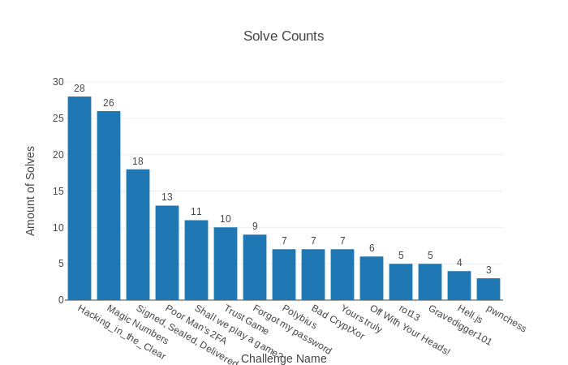
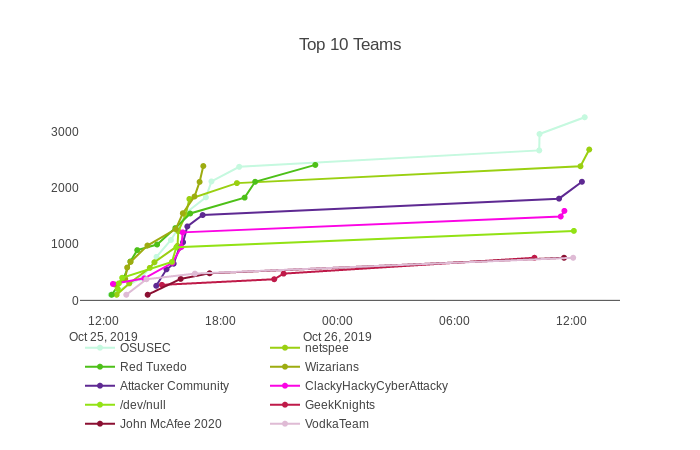

# BSidesPDX CTF 2019

## BSidesPDX

BSidesPDX CTF 2019 is using the [bsides-ctf-framework](https://github.com/BSidesPDX/bsides-ctf-framework). See [TTimzen's blog post](https://www.tophertimzen.com/blog/BSidesPDXCTFFramework/) for a detailed explanation of the framework, motivations, and instructions for writing challenges.

Challenge authors:
- [aagallag](https://twitter.com/aagallag)
- [fharding0](https://twitter.com/fharding0)
- [0xdade](https://twitter.com/0xdade)
- [fdcarl](https://twitter.com/fdcarl)
- [0x1nd0](https://twitter.com/0x1nd0)
- [MrDe4d](https://twitter.com/MrDe4d)
- [wireglitch](https://twitter.com/wireglitch)

## Final Statistics

The challenge ended with:

* 72 teams registered
* 135 individual players
* 158 flags submitted
* Every single challenge solved

The most solved challenges were:

* 28 solves for Hacking_in_the_clear (forensics)
* 26 solves for Magic Numbers (re)
  
The least solved challenges were:

* 3 solves for pwnchess (pwn)
* 4 solves for Hell.js (web)

The top 3 teams were:

* OSUSEC - 3378 points
* Attacker Community - 3110 points
* Red Tuxedo - 2844 points

## Challenges

| Challenge Name                                                 | Category      | Points | Port(s)             |
| -------------------------------------------------------------- | ------------- | ------ | ------------------- |
| [Poor Man's 2FA](physical/phys100-Poor_Mans_2fa)               | physical      | 100    | N/A                 |
| [Shall we play a game?](physical/phys200_Shall_we_play_a_game) | physical      | 200    | N/A                 |
| [Forgot my password](physical/phys300-Forgot_my_password)      | physical      | 300    | N/A                 |
| [Gravedigger101](data%20recovery/100-Gravedigger101/)          | data recovery | 100    | N/A                 |
| [OffWithYourHeads](data%20recovery/300-OffWithYourHeads!/)     | data recovery | 300    | N/A                 |
| [rot13](pwn/100-rot13/)                                        | pwn           | 100    | 1337                |
| [pwnchess](pwn/300-pwnchess/)                                  | pwn           | 300    | 31337               |
| [Magic Numbers](re/100-magicnumbers/)                          | re            | 100    | N/A                 |
| [Bad CryptXor](re/300-badcryptXor/)                            | re            | 300    | N/A                 |
| [Trust Game](misc/100-TrustGame/)                              | misc          | 100    | N/A                 |
| [Hacking_in_the_Clear](forensics/for100-Hacking_in_the_Clear/) | for           | 100    | N/A                 |
| [Polybius](forensics/for300-polybius/)                         | for           | 300    | N/A                 |
| [Signed, Sealed, Delivered, I'm Yours!](web/100-signedsealed/) | web           | 100    | 48323, 48324        |
| [Yours truly](web/200-yourstruly/)                             | web           | 200    | 8081, 9000, 8080    |
| [Hell.js](web/300-helljs/)                                     | web           | 300    | 27330, 27331, 27332 |

## Local Deployment

To locally test, deploy or play challenges with Docker, run the following (Ubuntu)

1. `sudo apt install docker-compose gcc-multilib g++-multilib linux-libc-dev:i386`
2. `make`
3. `docker-compose build && docker-compose up -d`
4. Containers are viewable at localhost:PORT (view with docker-compose ps)
5. `docker-compose kill` to stop the containers
6. `make clean` to clean the source folders

### Local Deployment for TrustGame

Unfortunately, we had issues getting TrustGame to work in a Docker container.  So this challenge must be run on the host system.

1. `cd misc/100-TrustGame/src`
2. `./server.py`

## Cloud Deployment

This year we ran all of our challenges in k8s using the Makefile and yamls in the `oci` directory of all pwn and web challenges.  Due to Docker issues with Trust Game, this was manually deployed to a standalone compute instance.
