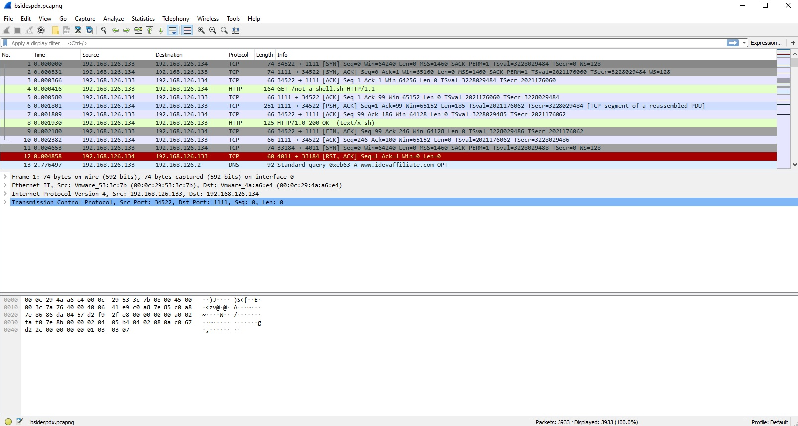

# Forensics 100 - Hacking_in_the_Clear - Solution

To solve this challenge you will need wireshark.

Open up wireshark and open up the Pcap. Inside the Pcap you will see a bunch of traffic ranging from tcp, DNS, UDP, and HTTP Traffic.

Right click on a TCP packet and select `Follow tcp stream`.

In the bottom right corner you will see up arrows and down arrows.  These will allow you to follow the tcp streams being sent.

If you keep following the stream you will stumble on the attacker ziping the loot and the password the attacker used to encrypt the data.

```
7za a -tzip -p44366fa4b464ce50daf0b55485463b81986f571a832a80a2f39e4276c527acd3 -mem=AES256 lootz.zip probablynottheflag.txt lootymclootface.txt  maybeflag.jpg could_be_flag.jpg
```

Now that you know the attacker zipped a bunch of files and encrypted it with a password it is time to get the zip.

To get the zip file go to `file -> export -> object -> HTTP` and select `lootz.zip` and save it to your machine.

Unzip the contents using the password that you found. 

Run cat or type the files inside the zip, inside `could_be_flag.jpg` you will find the flag.

`BSidesPDX{Th1is_is_why_yOu_sh0uld_use_F1l3}`


