# RE100 - Magic Numbers - Solution

## Basic analysis

It's good to start with collecting basic information about the binary.  The `file` command on Linux is a good start.

```
$ file challenge 
challenge: ELF 64-bit LSB executable, x86-64, version 1 (SYSV), dynamically linked, interpreter /lib64/ld-linux-x86-64.so.2, for GNU/Linux 3.2.0, BuildID[sha1]=e86f13bae6638e890d2f581ce833f14d15eb90bc, stripped
```

## Running the binary

Let's try running the binary (it's good practice to only run unknown binaries in an isolated VM).

```
$ ./challenge 
Enter the password
AAAABBBBB
wrong password...
```

Looks like we need to figure out the password to proceed.

## Static Analysis with IDA Freeware 7.0

Once you have loaded the binary into IDA (default options are fine), the first thing we should do, is try and determine when `Enter the password` is printed.  If we go to main, we can see the string near the top.

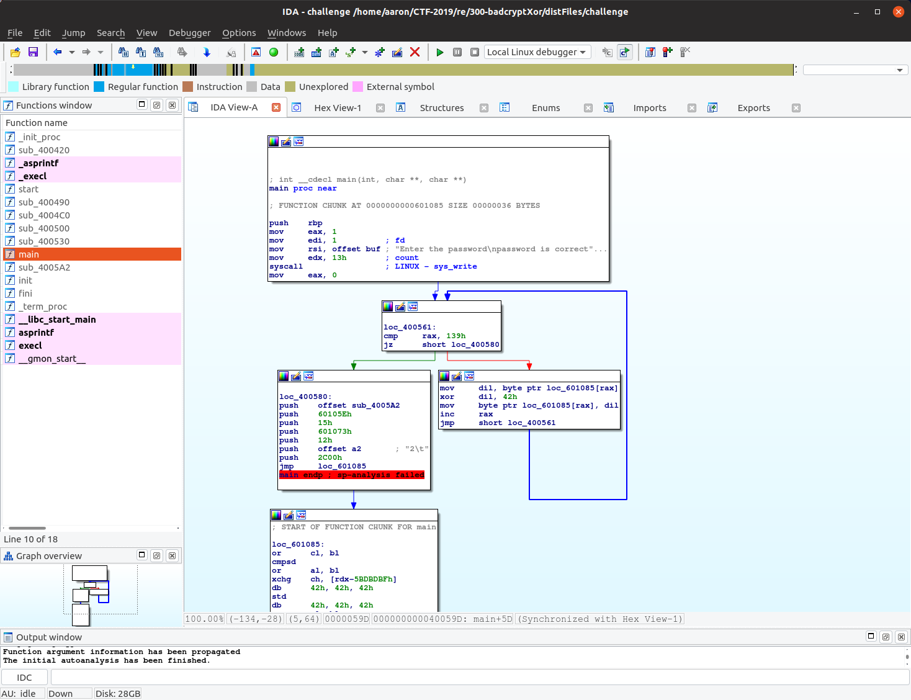

Notice, the binary isn't using the familiar libc function, `printf` or `puts` to print the string.  Instead it is directly performing a syscall to write to `stdout` (0x1).  This implies the challenge was either partially or entirely written in assembly.

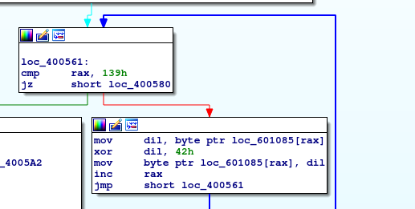

Well, looking a little further down, we can see a loop in which an xor cipher is performed against a hardcoded chunk of memory (`0x601085`), using the key: `0x42`.  Once that is done, it pushes a bunch of values to the stack and then jumps to `0x601085`.  And perhaps you notice the instructions at `0x601085` are really confusing, this is because these instructions are getting modified at runtime.

## Dynamic Analysis with IDA Freeware 7.0

In the writeup for Magic Numbers, I demonstrated how to use Ghidra to statically analyse the binary.  However, when reverse engineering, it's helpful to be aware of multiple techniques.  One trick I like is to leverage a debugger, this allows you to follow the binary's code execution in real-time.  You can use IDA Freeware to do so, alternatively, `GDB` can also be used.

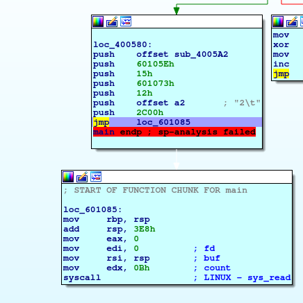

With IDA, you can set a breakpoint with `Right Click -> Add Breakpoint` or more simply press `F2`.  So let's go ahead and set a breakpoint at `jmp     loc_601085`(`0x40059D`).

Next, go ahead and run the program (press the green play button at the top).

Wow, notice how the next instructions are a little more straight forward?  That's because the instructions were just decrypted by the xor cipher.

### IDA Debugger Controls


These are the buttons used for controlling the debugger execution.  The play button will continue until the next breakpoint.  The stop button will halt all exection and exit debugger mode.  On the right side, the double arrows is the "Step Into" operation, meaning 1 instruction is executed, if it's a `call` to another function, the debugger will follow execution within the function.  The single arrow button is a "Step Over" operation, meaning 1 instruction is executed, but if it's a `call` to another function that entire function is allowed to execute.  These are the main operations, but feel free to experiment with the other ones.

---

Let's keep executing the instructions (by pressing either the Step Over or Step Into buttons.

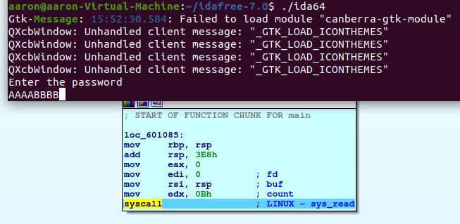

Notice when we get to the Syscall, the program hangs for a moment, that's because it's waiting for user input.  Let's go ahead and enter something.  Above, I entered `AAAABBBB`.

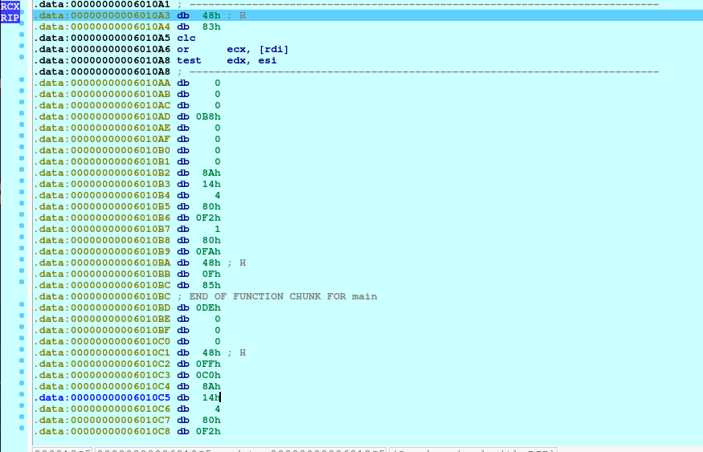

Ok, after the syscall operation completed, notice that IDA takes us out of graph view.  That's because IDA is behaving a little weird due to the strange behavior of the binary (modifying instructions at runtime).  This is pretty simple to fix though, just select the memory and press `C` to convert it to code.  You may have to do this a few times.  Once IDA renders the bytes as instructions, you can press spacebar to go back to graph view, you should have something similar to this now:

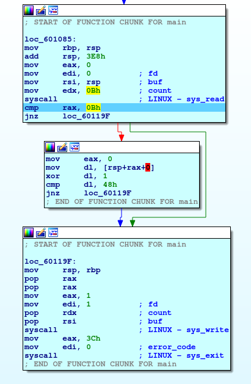

We notice the operation: `cmp     rax, 0Bh` immediately following the read.  So it looks like the program is expecting rax to be equal to `0xb`(11).

So you can either hover over `rax` or take a look at the Registers window.

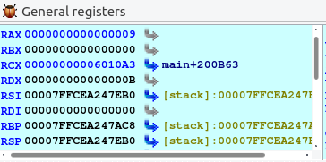

Hmm, so it's currently set to `0x9`.  This makes sense, since we used the input `AAAABBBB` which is length of 8, plus 1 for the newline character.  So you could restart the debugging and instead pass in a longer string, but that sounds tedious and IDA actually doesn't handle starting and stopping debugging weird code (self modifying code, common for packers and cryptors) like this very well.  So let's just manually change the code execution flow.

Using the debugger, we can easily change the flow of execution by changing where the instruction pointer is at.  To do this, select the instruction you want to execute and `Right Click -> Set IP`.

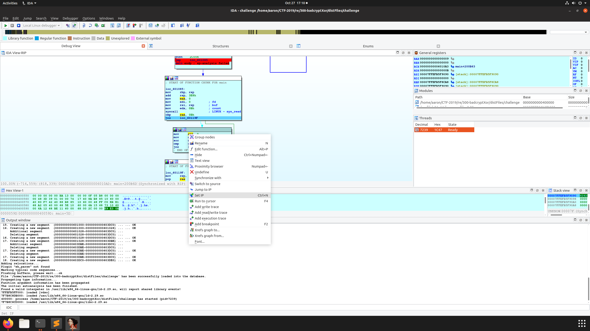

If we execute a few more instructions, we get to:

```
xor     dl, 1
cmp     dl, 48h
```

This looks like it may be an xor cipher and cause the password check to fail.  We can bypass this check by manually changing the value of register `dl` (lower bits of `rdx`) to 0x48.  Just double click RDX in the `General registers` window.

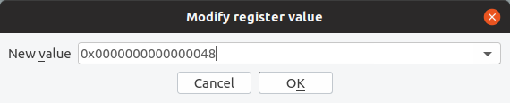

Now we can continue stepping and instead of failing the password check, it drops us out of graph view once again.  This time, the code looks correct, but I want to view it in graph view.  So you can `Right Click -> Create Function` or just press the `P` key to tell IDA this is a function (even though it's technically not).

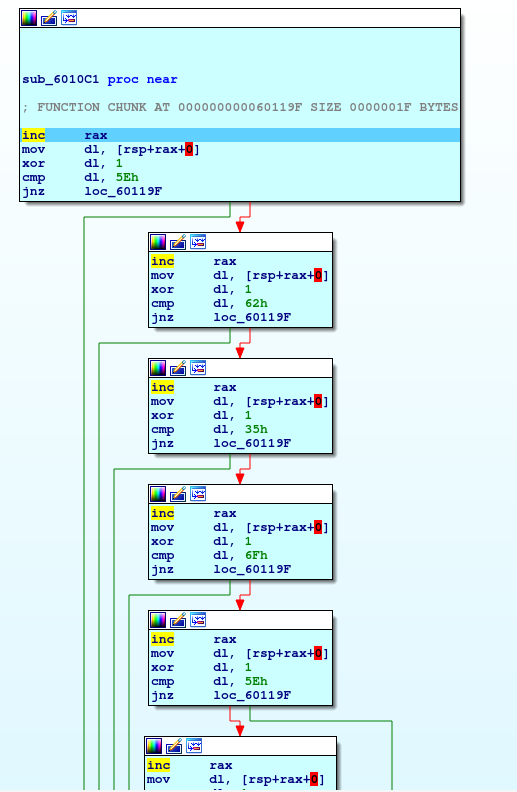

Ok, so this looks like each character of the password is being checked individually.

You could manually reverse the password, but I'm lazy, so let's once again change the instruction pointer to bypass all of this.

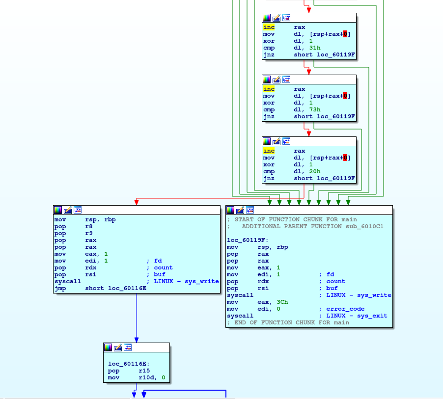

Notice the right side has many paths that lead to it, and it ultimately calls `exit`.  So let's not go there, and take the left path.

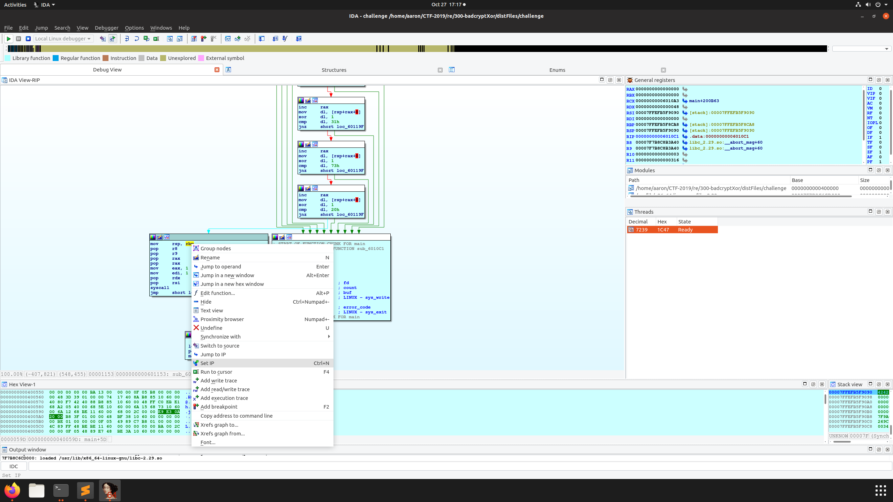

Keep stepping until you have executed the next syscall.  Now let's take a look at our terminal window.

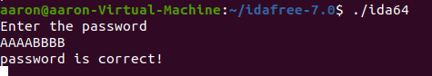

Great, we successfully bypassed the password check.  Let's continue stepping.

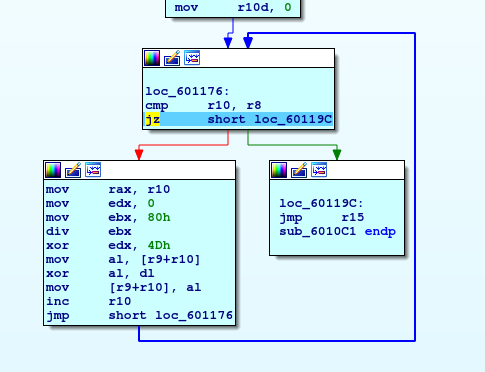

This looks like another xor loop.  Let's just set a breakpoint at `jmp r15` and then press the `Continue` button (green play button).

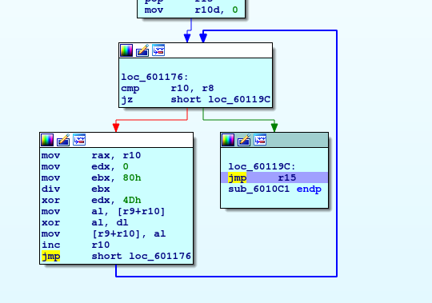

And following the jump to r15 takes us to...

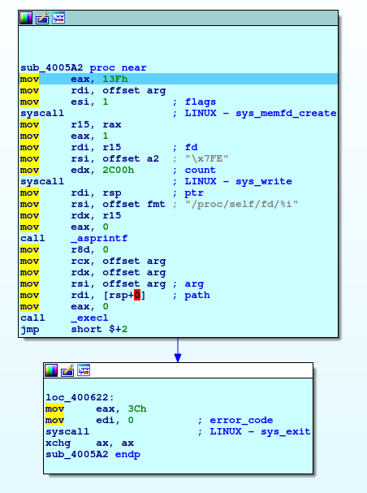

Huh, what's this?  What does `sys_memfd_create` do?  Well, you could do some googling, which might lead you to this helpful page: https://magisterquis.github.io/2018/03/31/in-memory-only-elf-execution.html

But even if you didn't figure out exactly how this is all working, you still might notice something interesting if you double click the `a2` variable and look at the memory there.

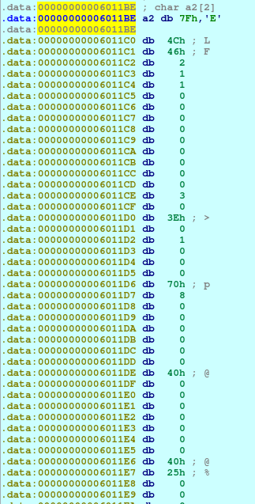

It starts with `\x7fELF`, this is the ELF magic number.  So this is another ELF binary within the initial binary.  Let's extract it!

In order to dump memory out of an IDA debugging session, I like to use this snippet of code:

```
auto fname      = "/home/aaron/innerfile";
auto address    = 0x6011BE;
auto size       = 0x2c00;
auto file= fopen(fname, "wb");

savefile(file, 0, address, size);
fclose(file);
```

Source: https://stackoverflow.com/a/48795835/3250699

To execute this, press `Shift + F2` and paste the code in and click the `Run` button.

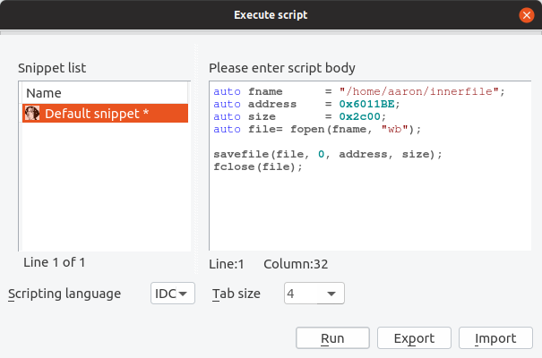

And then let's check to ensure it appears to have dumped the file:

```
$ file ~/innerfile
/home/aaron/innerfile: ELF 64-bit LSB shared object, x86-64, version 1 (SYSV), dynamically linked, interpreter /lib64/ld-linux-x86-64.so.2, for GNU/Linux 3.2.0, BuildID[sha1]=a313feb20430080c991e29a78e0b70e1a90750d7, stripped
```

Great, now let's close this IDA session and start a new one.

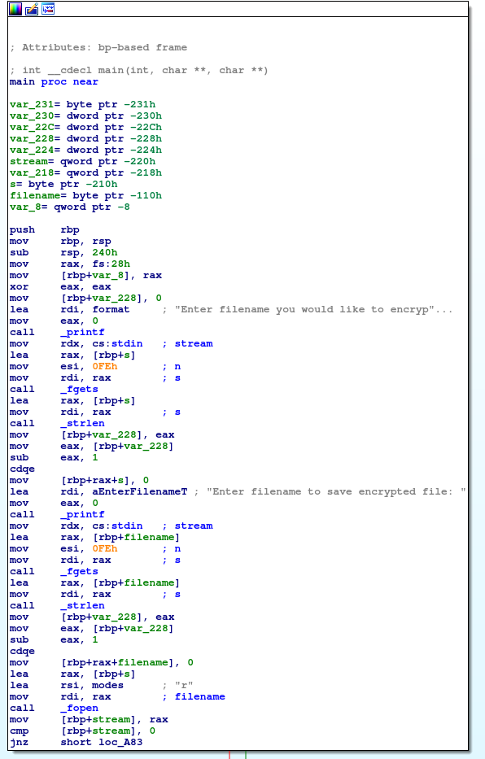

At the top of `main`, we can see a few strings that give hints towards what this inner binary is doing.  It is requesting the name of a file to encrypt and the name of the newly encrypted file.

Lets skip the standard calls to `fopen` and jump straight down to the encryption part of the code.

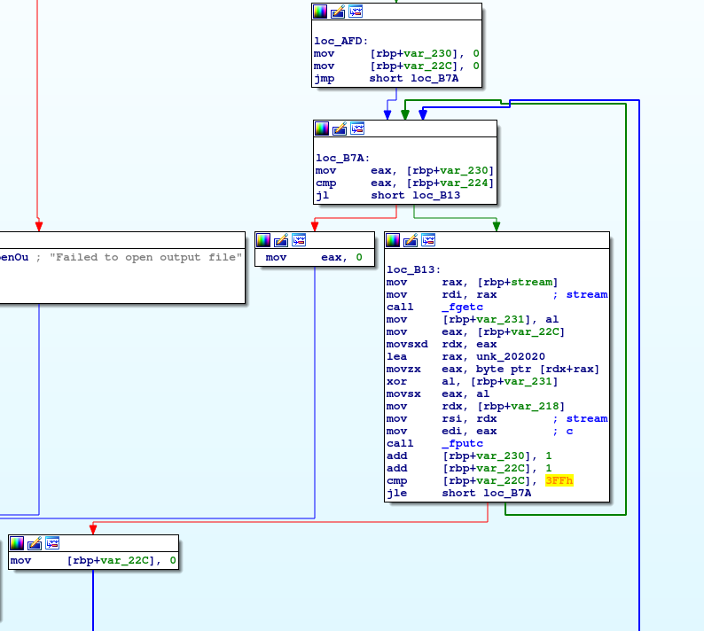

Once again, who could have guessed, an xor encryption is being performed.  This time, it's a little more complicated though.

It's not using a hardcoded key to encrypt, but instead, seems to be using the bytes at memory: `0x202020` as the key.

And it seems like this key has a length of 1024, since it resets back to 0 once `var_22c` is > 0x3ff (1023).

Since xor encryption is actually the same as xor decrpytion, we can use this encryption program to decrypt the provided `bsidesre300flag.png.enc` file for us.

```
$ chmod +x innerfile
$ ./innerfile 
Enter filename you would like to encrypt: bsidesre300flag.png.enc
Enter filename to save encrypted file: bsidesre300flag.png
```

And finally let's take a look at the image.

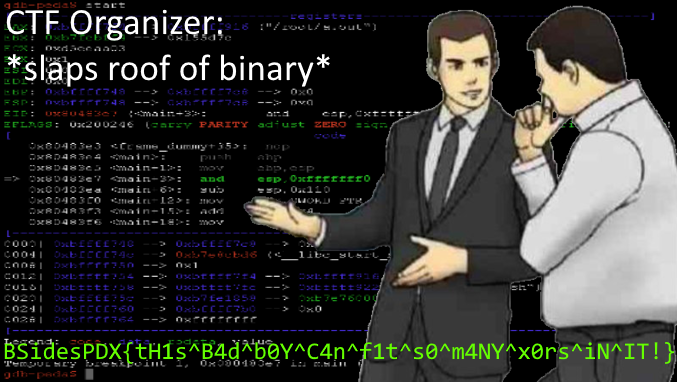
